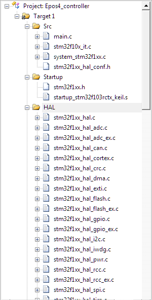
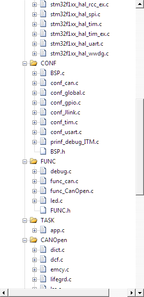
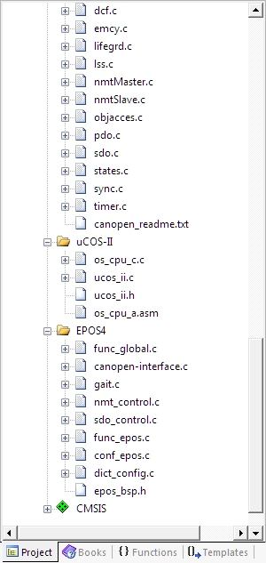

[TOC]


# EPOS4  Controller

Implementation of CANopen with STM32f103 for EPOS4 controlling. 


## How to use

Test  what you can do with this repository: 

1. prepare STM32F103 series controller board

2. add files to Keil

        

3. configure CANopen dictionary in `Middlewares/CANOpen/Cfg/`

4. compile and test


If your project is not using STM32F103 series chip for controling: 

1. transplant [CANfestival](https://canfestival.org/) to your project

2. add the `EPOS4/` folder to your project

3. configure CANopen dictionary

4. compile and test


## How does it work?


### CANopen protcol

CANopen is the internationally standardized (EN 50325-4) ([CiA301](http://can-cia.org/standardization/technical-documents)) higher-layer protocol for embedded control system built on top of CAN. For more information on CANopen see http://www.can-cia.org/

The repository uses [CANfestival](https://canfestival.org/)  to implement CANopen protcol.


### Configure your dictionary automatically

please refer to the documents in [CANfestival](https://canfestival.org/).


### Configure your dictionary manually

[Object Dictionary](https://www.can-cia.org/can-knowledge/canopen/device-architecture/) offers clear and flexible organisation of any variables. Variables can be accessed directly or via read/write functions.


in `dict.c`:

`const UNS8 TestMaster_iam_a_slave = 0;`   // master


#### SDO

**SDO server**  Index  0x1200H~0x127FH
if the control board is not a master, SDO server is mandatory. if is slave, SDO server is not needed.

```c
/* index 0x1200 :   SDO server parameter */
UNS8 ServerNumber_0x1200 = 2;						// subindex number -1 
UNS32 TestMaster_obj1200_COB_ID_SDO_CS_RX  = 0x601;
UNS32 TestMaster_obj1200_COB_ID_SDO_SC_TX = 0x581;
subindex TestMaster_Index1200[] =
 {
    { RO, uint8,  sizeof (UNS8), (void*)&ServerNumber_0x1200, NULL },
    { RO, uint32, sizeof (UNS32), (void*)&TestMaster_obj1200_COB_ID_SDO_CS_RX, NULL },
    { RO, uint32, sizeof (UNS32), (void*)&TestMaster_obj1200_COB_ID_SDO_SC_TX, NULL }
 };
```


**SDO clit**  Index  0x1280H~0x12FFH

if you have an EPOS4 with node id = 3,  you can configure SDO in `dict.c` as:

```c
/* index 0x1281 :   SDO clit .    Index 1280h-12FFh，Client SDO Parameter*/
UNS8 ClientNumber_0x1281 = 3;						// subindex number -1 
UNS32 TestMaster_obj1281_COB_ID_SDO_CS_TX  = 0x603;
UNS32 TestMaster_obj1281_COB_ID_SDO_SC_RX = 0x583;
UNS8 TestMaster_obj1281_COB_ID_Server = 3;			//server
subindex TestMaster_Index1281[] =
 {
    { RO, uint8,  sizeof (UNS8), (void*)&ClientNumber_0x1281, NULL },
    { RO, uint32, sizeof (UNS32), (void*)&TestMaster_obj1281_COB_ID_SDO_CS_TX, NULL },
    { RO, uint32, sizeof (UNS32), (void*)&TestMaster_obj1281_COB_ID_SDO_SC_RX, NULL },
    { RO, uint8,  sizeof (UNS8), (void*)&TestMaster_obj1281_COB_ID_Server, NULL },
 };
```


#### TPDO

Index 1800h-19FFh

if you want to send TPDO with cob-id=`0x202` everytime when SYNC is sent,  you can configure TPDO in `dict.c` as follows. In order to communicate with EPOS, make sure your RPDO cob-id in EPOS is also `0x202`. 

```c
/* index 0x1800 :   TPDO 1.  Index 1800h-19FFh,  Transmit PDO Communication Parameter  */ 
UNS8 ClientNumber_0x1800 = 5;
UNS32 TestMaster_obj1800_COB_ID_PDO = 0x202;
UNS8 TestMaster_obj1800_Transmiss_Type  = TRANS_EVERY_N_SYNC(1);
UNS16 TestMaster_obj1800_Inhibit_time = 1;						// time delay in TPDO
UNS8 TestMaster_obj1800_compatibility_entry = 0;
UNS16 TestMaster_obj1800_event_time  = 0;						// PDO mode
subindex TestMaster_Index1800[] = 
 {
     { RO, uint8,  sizeof (UNS8), (void*)&ClientNumber_0x1800, NULL },
     { RW, uint32, sizeof (UNS32), (void*)&TestMaster_obj1800_COB_ID_PDO, NULL },
     { RO, uint8, sizeof (UNS8), (void*)&TestMaster_obj1800_Transmiss_Type, NULL },
     { RW, uint16,  sizeof (UNS16), (void*)&TestMaster_obj1800_Inhibit_time, NULL },
     { RW, uint8, sizeof (UNS8), (void*)&TestMaster_obj1800_compatibility_entry, NULL },
     { RW, uint16,  sizeof (UNS16), (void*)&TestMaster_obj1800_event_time, NULL },
 };
```


**TPDO mapping** Index 1A00h-1BFFh

if you want to send ` Pos_SET_VALUE_node1` through TPDO, you need to configure TPDO mapping as:

```c
/* 0x1A00  Index 1A00h-1BFFh，Transmit PDO Mapping Parameter  Node0*/
UNS8 TestMaster_obj1A00_Number_mapped = 1;
UNS32 TestMaster_2_mapped = 0x20610020;		// index 0x2061, subindex 00, 32bit
subindex TestMaster_Index1A00[] = 
 {
   { RO, uint8, sizeof (UNS8), (void*)&TestMaster_obj1A00_Number_mapped, NULL },
   { RO, uint32, sizeof (UNS32), (void*)&TestMaster_2_mapped, NULL },
 };
```

Make sure entry with index equals `0x2061` exists:
```c
/*0x2061 node1*/
INTEGER32 Pos_SET_VALUE_node1 = 0x0;
subindex TestMaster_Index2061[] = {{ RW, int32, sizeof (INTEGER32), (void*)&Pos_SET_VALUE_node1, NULL },};
```


#### RPDO

Index: 0x1400H-0x15FFH

if you want to receive TPDO with cob-id=`0x182` everytime when SYNC is sent,  you can configure RPDO in `dict.c` as follows. In order to communicate with EPOS, make sure your TPDO cob-id in EPOS is also `0x182`. 

```c
/* index 0x1400 :   RPDO 1 parameter.*/ 
UNS8 TestMaster_highestSubIndex_obj1400 = 2; /* number of subindex - 1*/
UNS32 TestMaster_obj1400_COB_ID  = 0x00000182;
UNS8 TestMaster_obj1400_Transmission_type = TRANS_EVERY_N_SYNC(1);
subindex TestMaster_Index1400[] = 
 {
   { RO, uint8, 	sizeof (UNS8), (void*)&TestMaster_highestSubIndex_obj1400, NULL },
   { RW, uint32, 	sizeof (UNS32), (void*)&TestMaster_obj1400_COB_ID, NULL },
   { RO, uint8, 	sizeof (UNS8), (void*)&TestMaster_obj1400_Transmission_type, NULL },
 };
```


**RPDO mapping** 

Index 0x1600H-0x17FFH

Received TPDO are explained as 0x6061 entry in the first 32bit and 0x0001 entry in the following 32bit:

```c
 /* 0x1600	 Index 1600h-17FFh，Receive PDO Mapping Parameter  Node2*/
UNS8 TestMaster_obj1600_Number_mapped = 2; 

UNS32 TestMaster_obj1600_1_mapped = 0x60610020;
UNS32 TestMaster_obj1600_2_mapped = 0x00010020;	
subindex TestMaster_Index1600[] = 
{
 { RO, uint32, sizeof (UNS32), (void*)&TestMaster_obj1600_Number_mapped, NULL },
 { RO, uint32, sizeof (UNS32), (void*)&TestMaster_obj1600_1_mapped, NULL },
 { RO, uint32, sizeof (UNS32), (void*)&TestMaster_obj1600_2_mapped, NULL },
};
```


#### Add a new entray

All entries should be registered in `indextable TestMaster_objdict` and `indextable * TestMaster_scanIndexOD`.  Entry structure refers to:

```c
/*0x2061 node1*/
INTEGER32 Pos_SET_VALUE_node1 = 0x0;
subindex TestMaster_Index2061[] = {{ RW, int32, sizeof (INTEGER32), (void*)&Pos_SET_VALUE_node1, NULL },};
```


#### Other important things

* `s_PDO_status TestMaster_PDO_status`  counts at which received SYNC a PDO must be sent.

* Don’t forget to define SDO and TPO in `TestMaster_firstIndex` and `TestMaster_lastIndex`.  

  SDO_SVR indicates the index squence number of the SDO Server in dictionary. Specific number you can refer to `TestMaster_scanIndexOD` in `dict.c`. 

  The fllowing defines index squence number 4 as SDO Server, 5-10 as SDO client, 16 as RPDO, 25-37 as RPDO mapping, 38-43 as TPDO, 45-50 as TPDO mapping.

```c
const quick_index TestMaster_firstIndex = {
  4, /* SDO_SVR */
  5, /* SDO_CLT */
  16, /* PDO_RCV */
  25, /* PDO_RCV_MAP */
  38, /* PDO_TRS */
  45 /* PDO_TRS_MAP */
};

const quick_index TestMaster_lastIndex = {
  4, /* SDO_SVR */
  10, /* SDO_CLT */
  16, /* PDO_RCV */
  37, /* PDO_RCV_MAP */
  43, /* PDO_TRS */
  50 /* PDO_TRS_MAP */
};
```


### Hardware

* STM32F103

* EPOS4 50-15

* Maxon EC90


## Examples


### SDO drive mode
in `SDO` folder, motor is simply drived by SDO mode without using Festival library, which is useful in uncomplex driving situation.


### PDO drive mode
in `PDO` folder, motor is  drived by PDO mode with Festival library.

